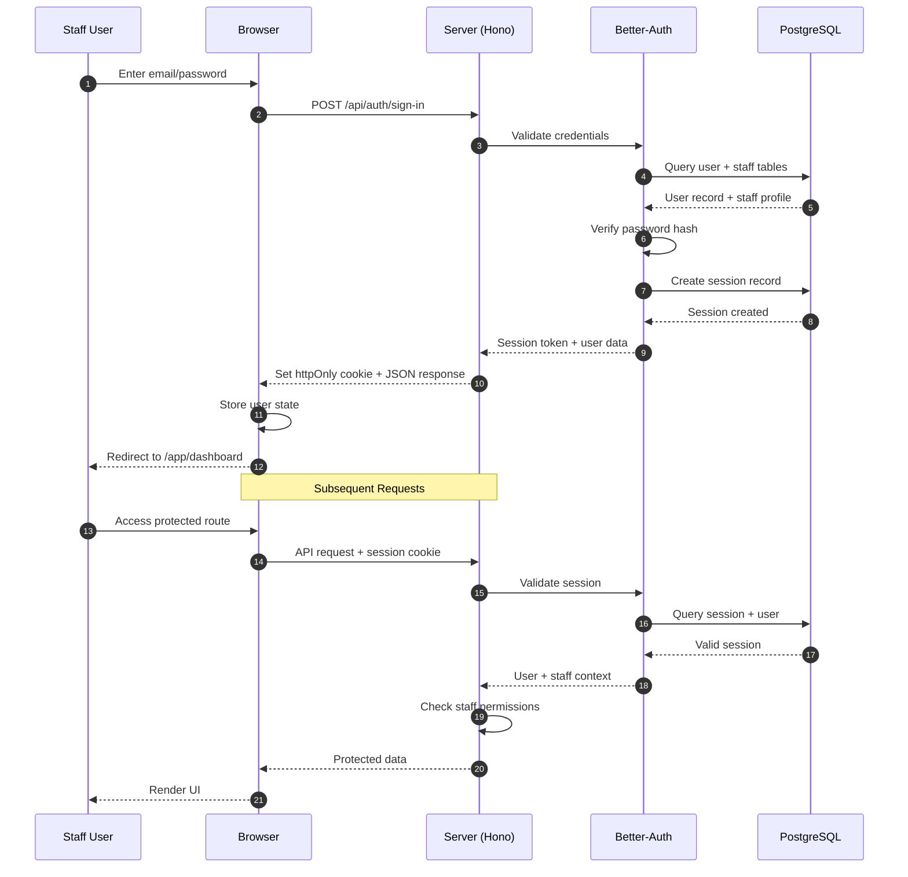
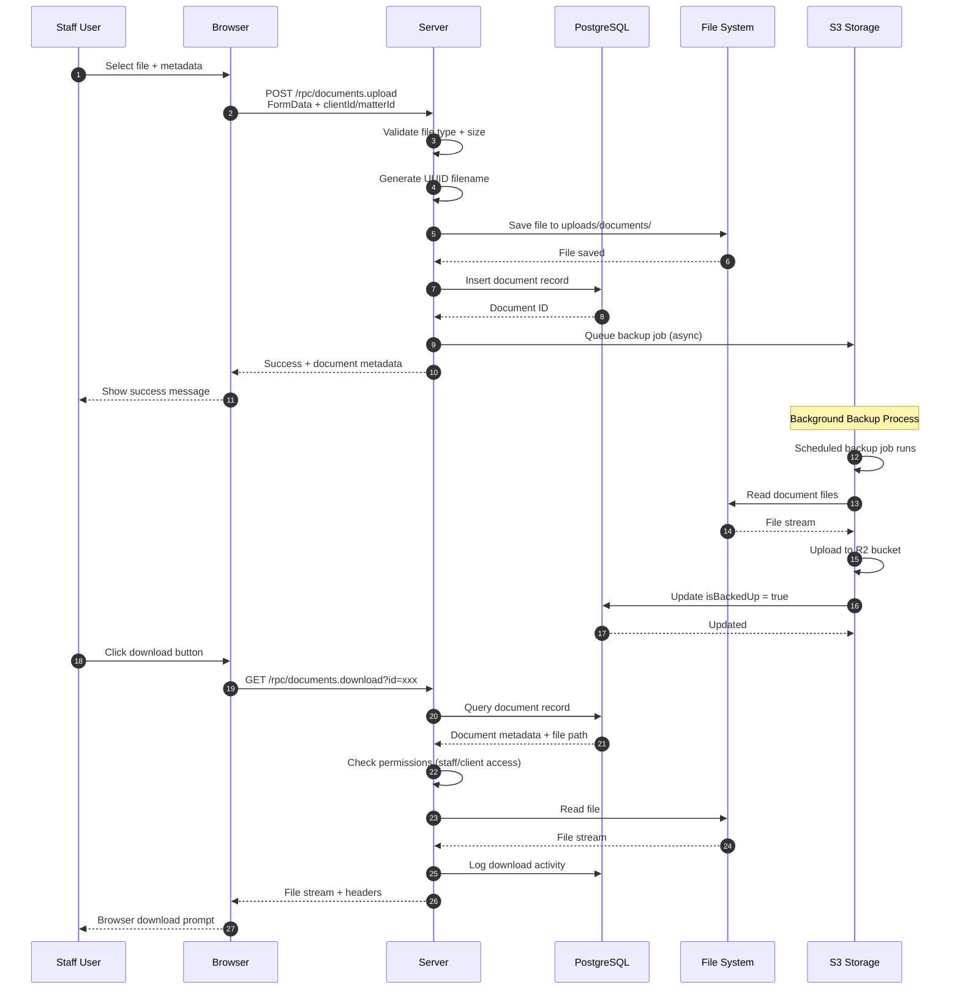
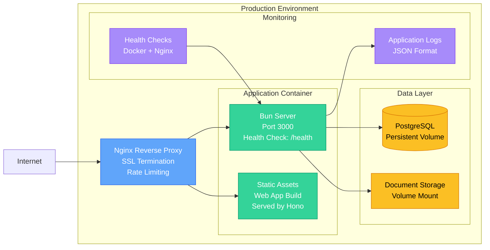

# GK-Nexus Architecture Diagram

This diagram illustrates the complete system architecture of GK-Nexus, showing the Turborepo monorepo structure, data flow, and external integrations.

## System Architecture

```mermaid
graph TB
    %% Client Layer
    subgraph "Client Browser"
        Browser[Web Browser<br/>React 19 SPA]
    end

    %% Application Layer
    subgraph "Turborepo Monorepo"
        subgraph "Apps"
            Web[Web App<br/>apps/web<br/>Port: 3001<br/>Tech: Vite + React 19 + TanStack Router]
            Server[Server<br/>apps/server<br/>Port: 3000<br/>Tech: Hono + Bun Runtime]
            Docs[Documentation<br/>apps/docs<br/>Port: 4321<br/>Tech: Astro Starlight]
        end

        subgraph "Shared Packages"
            API[API Package<br/>packages/api<br/>oRPC Routers + Procedures]
            Auth[Auth Package<br/>packages/auth<br/>Better-Auth Configuration]
            DB[Database Package<br/>packages/db<br/>Drizzle ORM + Schema]
        end
    end

    %% Data Layer
    subgraph "Data Storage"
        PostgreSQL[(PostgreSQL 16<br/>Primary Database)]
        FileSystem[Local File System<br/>Uploaded Documents]
    end

    %% External Services
    subgraph "External Services"
        Resend[Resend API<br/>Email Delivery<br/>Portal Invites, Notifications]
        S3[S3-Compatible Storage<br/>Cloudflare R2<br/>Document Backups]
        GRA[GRA API<br/>Guyana Revenue Authority<br/>Tax Compliance - Phase 3]
        WhatsApp[WhatsApp Business<br/>Client Messaging<br/>Phase 3]
    end

    %% Data Flow - Client to Web App
    Browser -->|HTTPS Request<br/>Port 3001| Web
    Web -->|Serve Static Assets<br/>index.html + JS/CSS| Browser

    %% Data Flow - Web App to Server
    Browser -->|API Calls<br/>POST /rpc/[procedure]<br/>JSON-RPC-like Protocol| Server

    %% Data Flow - Server Internal Architecture
    Server -->|oRPC Handler<br/>Type-safe RPC| API
    Server -->|Authentication Middleware<br/>Session Management| Auth
    API -->|Database Queries<br/>Type-safe ORM| DB
    DB -->|SQL Queries| PostgreSQL
    Auth -->|Session Persistence<br/>User Management| PostgreSQL

    %% Document Upload/Download Flow
    Server -->|File Upload<br/>Document Storage| FileSystem
    Server -->|Cloud Backup<br/>Automated Sync| S3
    FileSystem -->|Serve Documents<br/>Secure Download| Server

    %% External Service Integrations
    Server -->|Send Emails<br/>Portal Invites, Reminders| Resend
    Server -->|Backup Database<br/>Scheduled + Manual| S3
    Server -.->|Tax API Integration<br/>Future Phase 3| GRA
    Server -.->|WhatsApp Messaging<br/>Future Phase 3| WhatsApp

    %% Documentation Access
    Browser -.->|Access Docs<br/>Port 4321<br/>Development Only| Docs

    %% Styling
    classDef appStyle fill:#3B82F6,stroke:#1E40AF,color:#fff
    classDef packageStyle fill:#8B5CF6,stroke:#6D28D9,color:#fff
    classDef dataStyle fill:#10B981,stroke:#059669,color:#fff
    classDef externalStyle fill:#F59E0B,stroke:#D97706,color:#fff
    classDef futureStyle fill:#6B7280,stroke:#4B5563,color:#fff,stroke-dasharray: 5 5

    class Web,Server,Docs appStyle
    class API,Auth,DB packageStyle
    class PostgreSQL,FileSystem dataStyle
    class Resend,S3 externalStyle
    class GRA,WhatsApp futureStyle
```

## Authentication Flow



## Document Upload/Download Flow



## Technology Stack

### Frontend (Web App)
- **Framework**: React 19 with function components
- **Routing**: TanStack Router (file-based routing)
- **Build Tool**: Vite (fast HMR, ESM-native)
- **API Client**: oRPC client (type-safe RPC calls)
- **State Management**: TanStack Query (server state) + React hooks (local state)
- **UI Components**: shadcn/ui (Tailwind CSS + Radix UI)
- **Forms**: React Hook Form + Zod validation

### Backend (Server)
- **Runtime**: Bun (fast JavaScript runtime)
- **Framework**: Hono (lightweight web framework)
- **API Layer**: oRPC (type-safe RPC with automatic client generation)
- **Authentication**: Better-Auth (session-based with PostgreSQL)
- **ORM**: Drizzle ORM (type-safe SQL query builder)
- **Validation**: Zod schemas
- **File Uploads**: Multipart form handling

### Database
- **Primary DB**: PostgreSQL 16
- **Schema Management**: Drizzle migrations
- **Connection Pooling**: Built-in Bun PostgreSQL driver

### Infrastructure
- **Monorepo**: Turborepo (build caching, task orchestration)
- **Package Manager**: Bun (fast install, workspaces)
- **Containerization**: Docker + Docker Compose
- **Code Quality**: Ultracite (Biome-based linting/formatting)

### External Integrations
- **Email**: Resend API
- **Storage**: Cloudflare R2 (S3-compatible)
- **Future**: GRA API, WhatsApp Business

## Deployment Architecture



## Security Model

### Authentication Layers

1. **Staff Authentication**: Better-Auth with password hashing (bcrypt)
2. **Client Portal**: Separate portal user system with invite tokens
3. **Session Management**: Secure httpOnly cookies, 30-minute inactivity timeout
4. **Password Setup**: Token-based onboarding for new staff members

### Authorization Model

| Role | Permissions |
|------|-------------|
| OWNER | Full system access, all businesses |
| GCMC_MANAGER | Full GCMC access, staff management |
| KAJ_MANAGER | Full KAJ access, staff management |
| STAFF_GCMC | GCMC client/matter access (view/edit) |
| STAFF_KAJ | KAJ client/matter access (view/edit) |
| STAFF_BOTH | Both GCMC + KAJ access |
| RECEPTIONIST | Read-only access, appointment scheduling |

### Data Isolation

- Business-level isolation (GCMC vs KAJ)
- Role-based access control (RBAC) at API layer
- Client portal users limited to own data only
- Staff impersonation logging for audit trail

## Performance Characteristics

- **Build Time**: <5 minutes (with Docker BuildKit caching)
- **Image Size**: <300MB (optimized with Turbo prune)
- **Cold Start**: <60 seconds (container startup)
- **Hot Reload**: <200ms (Vite HMR in development)
- **API Response**: <100ms average (database queries)
- **Health Check**: <1 second response time

## Backup Strategy

### Backup Utilities (packages/api/src/utils/)

1. **backup-utility.ts**: Creates compressed JSON backups
   - Exports all database tables with relationships
   - Uses Node.js zlib for compression
   - Works inside Docker containers (no external dependencies)
   - Generates backup metadata (timestamp, size, table counts)

2. **backup-restore.ts**: Restores from backups
   - Validates backup integrity before restoration
   - Preview mode to inspect contents before applying
   - Selective restoration by table/scope
   - Transaction-based with rollback on error

3. **backup-scheduler.ts**: Automated scheduling
   - Daily, weekly, monthly schedules
   - Configurable retention policies
   - Background execution with logging

4. **google-drive-storage.ts**: Cloud backup (foundation)
   - OAuth2 authentication flow
   - Upload/download methods

### Backup Types

| Type | Contents | Frequency |
|------|----------|-----------|
| Full | All database tables | Weekly |
| Clients | Clients, contacts, linked clients | On demand |
| Matters | Matters, documents, notes | On demand |
| Documents | Document metadata, files | On demand |
| Invoices | Invoices, line items, payments | Monthly |
| Custom | User-selected tables | On demand |

### Backup Flow

1. **Creation**: API → backup-utility.ts → Compressed JSON → Local storage
2. **Scheduling**: backup-scheduler.ts → Cron-like execution → Automatic backups
3. **Restoration**: API → backup-restore.ts → Validation → Transaction-based restore
4. **Cloud Sync**: Local backup → google-drive-storage.ts → Google Drive (optional)

---

**Last Updated**: 2024-12-24
**Maintained By**: Development Team
